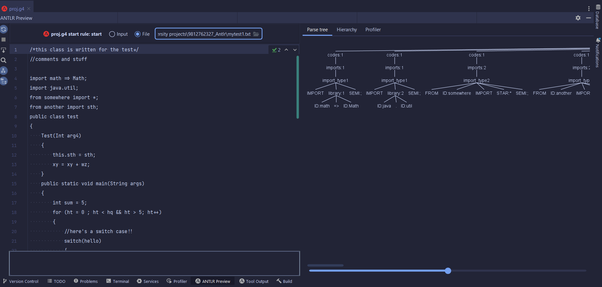

# Grammar with ANTLR

Welcome to this repo! This project aims to implement the grammar (parser and lexer rules) of a simple programming language and visualize the parse tree generated using ANTLR. Below is an overview of the language structure and features:

## Language Structure

1. **Library Import**: Required libraries can be imported at the beginning of the program or functions.
2. **Class Definition**: Each program includes one or more classes.
3. **Command Termination**: Commands must end with a semicolon (;).
4. **Block Definition**: Blocks are defined with curly braces { and }.
5. **Class Components**: Each class can include functions and variable definitions.
6. **Naming Rules**:
   - Minimum length of two characters.
   - Cannot start with a number.
   - Consists of upper and lowercase Latin letters, numbers, '$', and '_'.
   - Reserved words (keywords) cannot be used as variable names.
7. **Access Level Specification**: Before defining variables and functions, you can set the access level as public, private, or protected.
8. **Commenting**: Two ways of commenting are supported: line-single and line-multi. The character for comments can be specified.

other common structures like switch-case, while, for loop, if conditions, initilaizations, method contruction etc are supported by my written grammar.

## Usage

You have to first install the ANTLR plugin on your IDE. I've used Intellij Idea for this.
1. Simply choose `ANTLR Preview` from bottom of Intellij Idea.
2. choose `File` and import one of the test cases present in the project folder.
3. There you go! You can see the Parse tree of the code.

## Result
You can see the output of one the test cased below:

## Contact
Created by [mahya.ehsanimehr@gmail.com](mailto:mahya.ehsanimehr@gmail.com) - feel free to contact me!
